# PokemonGenerator


## Overview

This project uses one variant of Generative Adversarial Network (GAN) known as Wasserstein GAN (WGAN) to generate new Pokemon. The implementation is according to [this](https://arxiv.org/abs/1701.07875) paper.

The credits for the Pokemon dataset goes to [kvpratama](https://github.com/kvpratama), the dataset can be viewed [here](https://github.com/kvpratama/gan/tree/master/pokemon/data/pokemon)

Check out my [blog post](https://ankitesh97.github.io/blog/2018/04/21/pokemon-generation-using-wgans/) on this project
## Dependencies
```
pickle
cv2
numpy
scipy
tensorflow (>=1.0)
```

## Usage

To generate new images one simply need to run the respective file by proving it with the command line arguments. Images will be generated in a folder called as "test_generated". Make sure to replace the "MODEL_ADD" variable in code if you want to generate new images using your trained model, by default trained model's address is stored.

*To generate 100 MNIST images*
```
> python mnist_wgan_64x64.py --test 100
```

*To generate 100 pokemon images*
```
> python pokeGan.py --test 100
```
To train on your own dataset, first you need to preprocess the data by running [preprocess.py](https://github.com/ankitesh97/Gans/PokemonGenerator/preprocess.py), replace the "DATA_FILE" variable to your dataset file (make sure all are of the same size) and change "LOAD_FILE" to the place where you want to save the preprocessed data. Also change "CHANNEL" and "SIZE" according to your dataset.  
Once the data is preprocessed run the [pokeGan.py](https://github.com/ankitesh97/Gans/PokemonGenerator/pokeGan.py) without the test flag, make sure to change "MODEL_ADD" variable, this will train the model and save it at the "MODEL_ADD" address.

## Method

### Preprocessing
The raw data was of varying dimensions, so first task was to resize the images to 128x128, below are some of the resized images  

**Resized Images**    

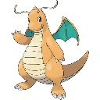  &nbsp;&nbsp;&nbsp;&nbsp;&nbsp;&nbsp;&nbsp;&nbsp;&nbsp;&nbsp;&nbsp;&nbsp;&nbsp;&nbsp;&nbsp;&nbsp;&nbsp;&nbsp;&nbsp;&nbsp;&nbsp;&nbsp;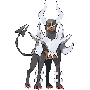
&nbsp;&nbsp;&nbsp;&nbsp;&nbsp;&nbsp;&nbsp;&nbsp;&nbsp;&nbsp;&nbsp;&nbsp;&nbsp;&nbsp;&nbsp;&nbsp;&nbsp;&nbsp;&nbsp;&nbsp;&nbsp;&nbsp;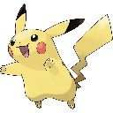  

&nbsp;&nbsp;&nbsp;&nbsp;&nbsp;&nbsp;&nbsp;&nbsp; Dragonite &nbsp;&nbsp;&nbsp;&nbsp;&nbsp;&nbsp;&nbsp;&nbsp;&nbsp;&nbsp;&nbsp;&nbsp;&nbsp;&nbsp;&nbsp;&nbsp;&nbsp;&nbsp;&nbsp;&nbsp;&nbsp;&nbsp;&nbsp;&nbsp;&nbsp;&nbsp;&nbsp;&nbsp;&nbsp;&nbsp;&nbsp;&nbsp;&nbsp;&nbsp;&nbsp; Mega Houndoom &nbsp;&nbsp;&nbsp;&nbsp;&nbsp;&nbsp;&nbsp;&nbsp;&nbsp;&nbsp;&nbsp;&nbsp;&nbsp;&nbsp;&nbsp;&nbsp;&nbsp;&nbsp;&nbsp;&nbsp;&nbsp;&nbsp;&nbsp;&nbsp;&nbsp;&nbsp;&nbsp;&nbsp;&nbsp;&nbsp;&nbsp;&nbsp;&nbsp;&nbsp;&nbsp; Pikachu


There were total 819 pokemon images, since GANS require a large amount to data to learn the distribution the primary step was to augment the data. In the augmentation code first the images were flipped and then it was rotated. Finally the size of the dataset was 8190, the augmentation code can be seen [here](https://github.com/ankitesh97/Gans/PokemonGenerator/augment.py).

The images were then normalized and then the class was pickled, the code to the preprocessing step can be found [here](https://github.com/ankitesh97/Gans/PokemonGenerator/preprocess.py)

### Experiments

#### MNIST
First the model was trained and tested on MNIST dataset, just to see if the implementation was correct, below are the samples generated while training. The code for this can be found  [here](https://github.com/ankitesh97/Gans/PokemonGenerator/mnist_wgan_64x64.py).    

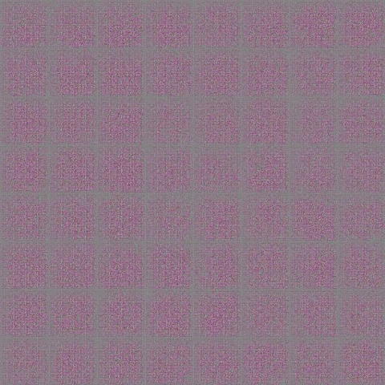  

<br>

##### Pokemon  
The model's architecture was changed according to the input image dimension, below are the samples generated while training on the pokemon dataset.

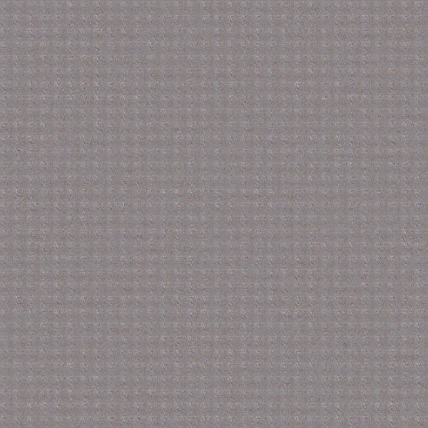  

The loss curves of discriminator and generator were drawn on tensorboard, below are curves, on the x axis number of networks updates performed, and on the y axis loss value.  
<br>
**Discriminator Loss**
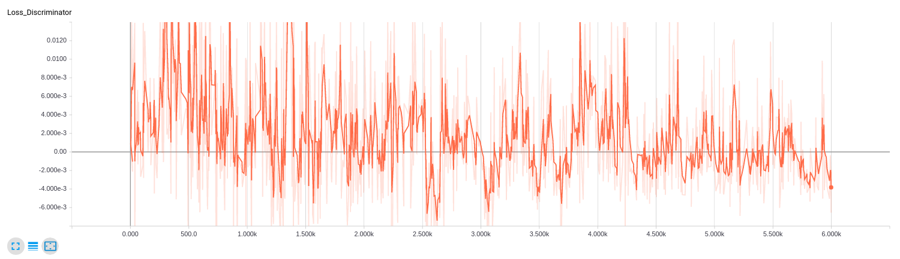  

**Generator Loss**
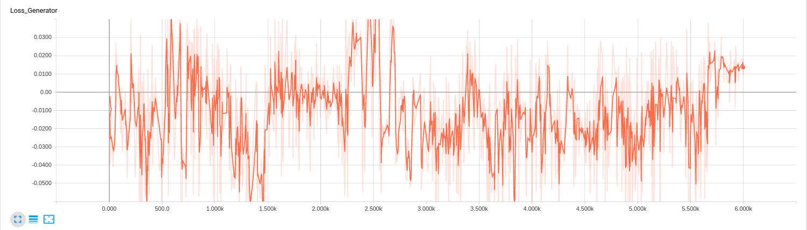


### Results

Although results were not that good on the pokemon dataset, but the model still learned the shape of the pokemons. The images are not that defined, but the structure is learned. The model performed well on the MNIST dataset, but still the generated images were a bit foggy. Below are some of the best generated images.


**MNIST**  
These were generated after 200 epochs  
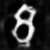&nbsp;&nbsp;&nbsp;&nbsp;&nbsp;&nbsp;
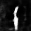&nbsp;&nbsp;&nbsp;&nbsp;&nbsp;&nbsp;
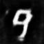&nbsp;&nbsp;&nbsp;&nbsp;&nbsp;&nbsp;
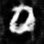&nbsp;&nbsp;&nbsp;&nbsp;&nbsp;&nbsp;
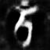&nbsp;&nbsp;&nbsp;&nbsp;&nbsp;&nbsp;
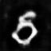&nbsp;&nbsp;&nbsp;&nbsp;&nbsp;&nbsp;
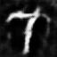&nbsp;&nbsp;&nbsp;&nbsp;&nbsp;&nbsp;


**Pokemon**  
These were generated after 1000 epochs  
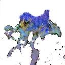&nbsp;&nbsp;&nbsp;&nbsp;&nbsp;&nbsp;
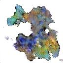&nbsp;&nbsp;&nbsp;&nbsp;&nbsp;&nbsp;
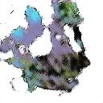&nbsp;&nbsp;&nbsp;&nbsp;&nbsp;&nbsp;
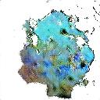&nbsp;&nbsp;&nbsp;&nbsp;&nbsp;&nbsp;
